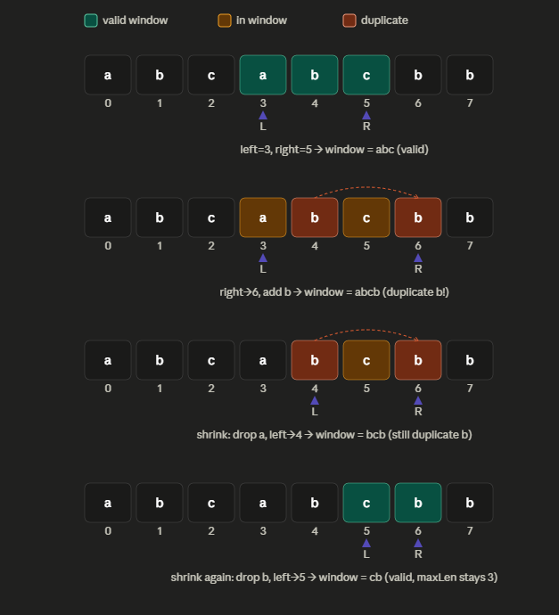

## Two Pointers
- A technique where you use two index variables(pointers) to traverse a data structure(usually an array or a linked list) instead of using nested loops.
- It reduces most O(n^2) -brute force to O(n)
    ```
    let left = 0;
    let right = arr.length - 1;
    while (left < right) {
    // do something with arr[left] and arr[right]
    // move left++ or right-- based on a condition
    }
    ```
### Main Patterns
#### 1. Opposite ends, moving inward(converging pointers)
- Used when the array is sorted and you're looking for a pair/combination satisfying some conditioon
    ```
    function twoSumSorted(arr, target) {
        let left = 0, right = arr.length - 1;
        while (left < right) {
            const sum = arr[left] + arr[right];
            if (sum === target) return [left, right];
            if (sum < target) left++;   // need a bigger sum
            else right--;                // need a smaller sum
        }
        return [-1, -1];
        }

        console.log(twoSumSorted([1, 2, 3, 4, 6], 6)); // [1, 3] -> 2 + 4
    ```
#### 2. Same direction, different speeds(fast and slow pointers)
 - Both pointers start at the beginning but move at different rates or under different conditions
    ```
    function removeDuplicates(nums) {
        let slow = 0; // tracks the position of the last unique element
        for (let fast = 1; fast < nums.length; fast++) {
            if (nums[fast] !== nums[slow]) {
            slow++;
            nums[slow] = nums[fast];
            }
        }
        return slow + 1; // new length
        }

        console.log(removeDuplicates([1,1,2,2,3])); // 3 -> [1,2,3,...]

    ```
#### 3. Sliding window(A two pointer variant)
- Both pointers move in the same direction, but they define a window that expands and contracts.
    ```
        function longestUniqueSubstring(s) {
            let left = 0, maxLen = 0;
            const seen = new Set();

            for (let right = 0; right < s.length; right++) {
                while (seen.has(s[right])) {
                seen.delete(s[left]);
                left++;
                }
                seen.add(s[right]);
                maxLen = Math.max(maxLen, right - left + 1);
            }
            return maxLen;
            }

            console.log(longestUniqueSubstring("abcabcbb")); // 3 -> "abc"
    ```
    